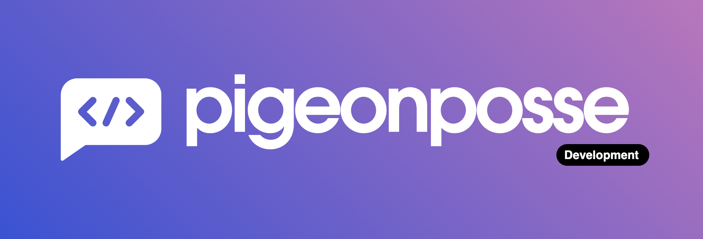

<!--

██████╗ ██╗ ██████╗ ███████╗ ██████╗ ███╗   ██╗
██╔══██╗██║██╔════╝ ██╔════╝██╔═══██╗████╗  ██║
██████╔╝██║██║  ███╗█████╗  ██║   ██║██╔██╗ ██║
██╔═══╝ ██║██║   ██║██╔══╝  ██║   ██║██║╚██╗██║
██║     ██║╚██████╔╝███████╗╚██████╔╝██║ ╚████║
╚═╝     ╚═╝ ╚═════╝ ╚══════╝ ╚═════╝ ╚═╝  ╚═══╝

██████╗  ██████╗ ███████╗███████╗███████╗
██╔══██╗██╔═══██╗██╔════╝██╔════╝██╔════╝
██████╔╝██║   ██║███████╗███████╗█████╗
██╔═══╝ ██║   ██║╚════██║╚════██║██╔══╝
██║     ╚██████╔╝███████║███████║███████╗
╚═╝      ╚═════╝ ╚══════╝╚══════╝╚══════╝

█████╗█████╗█████╗█████╗█████╗█████╗█████╗█████╗
╚════╝╚════╝╚════╝╚════╝╚════╝╚════╝╚════╝╚════╝

██╗    ██╗███████╗██████╗
██║    ██║██╔════╝██╔══██╗
██║ █╗ ██║█████╗  ██████╔╝
██║███╗██║██╔══╝  ██╔══██╗
╚███╔███╔╝███████╗██████╔╝
 ╚══╝╚══╝ ╚══════╝╚═════╝

VERSION: 0.0.22
AUTHOR: Angelo (https://github.com/angelespejo)
REPOSITORY: https://github.com/pigeonposse/pigeon-web

DEVELOPED BY PIGEONPOSSE 🐦🌈

-->

# _PigeonPosse_ Web ✨

Official web for _PigeonPosse_ collective. ✨

> New web in: [MAIN BRANCH](https://github.com/pigeonposse/pigeon-web/tree/main)

- Web 2023 in: [2023 BRANCH](https://github.com/pigeonposse/pigeon-web/tree/2023)
- Web 2024 in: [2024 BRANCH](https://github.com/pigeonposse/pigeon-web/tree/2024)

## ⚙️ Usage

- [Read more](./packages/web/README.md)

## ☑️ TO-DO LIST

Do you want to contribute?

[Todo list](/docs/todo)

## 👨‍💻 Development

You can contribute via **_Github_**.

## ☕ Donate

Help us to develop more interesting things.

## 📜 License

This software is licensed with _**[GPLv3](/LICENSE)**_.

## 🐦 About us

_PigeonPosse_ is a ✨ **code development collective** ✨ focused on creating practical and interesting tools that help developers and users enjoy a more agile and comfortable experience. Our projects cover various programming sectors and we do not have a thematic limitation in terms of projects.

### Collaborators

|                                                                                    | Name        | Role         | GitHub                                         |
| ---------------------------------------------------------------------------------- | ----------- | ------------ | ---------------------------------------------- |
|  | Angelo | Author | [@Angelo](https://github.com/angelespejo) |
|  | PigeonPosse | Collective | [@PigeonPosse](https://github.com/PigeonPosse) |

 
