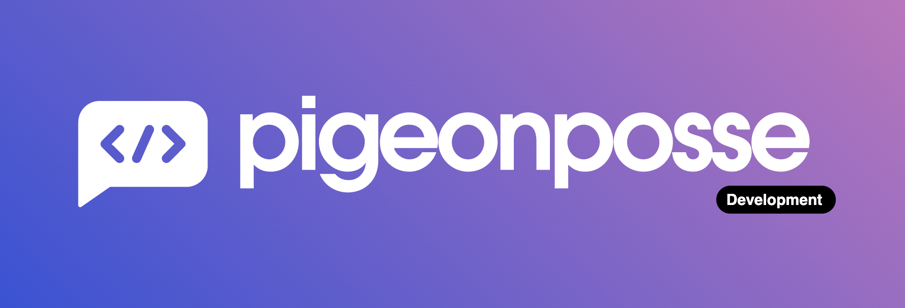

<!-- PIGEONPOSSE START MARK -->
<!-- 

██████╗ ██╗ ██████╗ ███████╗ ██████╗ ███╗   ██╗
██╔══██╗██║██╔════╝ ██╔════╝██╔═══██╗████╗  ██║
██████╔╝██║██║  ███╗█████╗  ██║   ██║██╔██╗ ██║ 
██╔═══╝ ██║██║   ██║██╔══╝  ██║   ██║██║╚██╗██║ 
██║     ██║╚██████╔╝███████╗╚██████╔╝██║ ╚████║ 
╚═╝     ╚═╝ ╚═════╝ ╚══════╝ ╚═════╝ ╚═╝  ╚═══╝ 
                                                
██████╗  ██████╗ ███████╗███████╗███████╗       
██╔══██╗██╔═══██╗██╔════╝██╔════╝██╔════╝       
██████╔╝██║   ██║███████╗███████╗█████╗         
██╔═══╝ ██║   ██║╚════██║╚════██║██╔══╝         
██║     ╚██████╔╝███████║███████║███████╗       
╚═╝      ╚═════╝ ╚══════╝╚══════╝╚══════╝       
                                                                                                                                                
█████╗█████╗█████╗█████╗█████╗█████╗█████╗█████╗
╚════╝╚════╝╚════╝╚════╝╚════╝╚════╝╚════╝╚════╝ 

██╗    ██╗███████╗██████╗                       
██║    ██║██╔════╝██╔══██╗                      
██║ █╗ ██║█████╗  ██████╔╝                      
██║███╗██║██╔══╝  ██╔══██╗                      
╚███╔███╔╝███████╗██████╔╝                      
 ╚══╝╚══╝ ╚══════╝╚═════╝                       
                                                
VERSION: 0.0.18 
AUTHOR: Angelo (https://github.com/angelespejo)
REPOSITORY: https://github.com/pigeonposse/pigeon-web

DEVELOPED BY PIGEONPOSSE 🐦🌈

-->
<!-- PIGEONPOSSE END MARK -->

# _PigeonPosse_ Web ✨

## 🗒 Description

Official web for _PigeonPosse_ collective. ✨

<!-- PIGEONPOSSE START USAGE -->

> For development you need to add a file ".env" with PIGEONPOSSE_GH_API_TOKEN=changeToYourGithubApiToken

### ⚙️ Usage

- [Docker image](https://hub.docker.com/r/pigeonposse/pigeon-web)
- [Using docker compose](/docker-compose.yml)

<!-- PIGEONPOSSE END USAGE -->

<!-- PIGEONPOSSE START ORG -->

## 👨‍💻 Development

You can contribute via **_Github_**.

## ☕ Donate

Help us to develop more interesting things.

 

## 📜 License

This software is licensed with ***[GPLv3](/LICENSE)***.

## 🐦 About us

_PigeonPosse_ is a ✨ **code development collective** ✨ focused on creating practical and interesting tools that help developers and users enjoy a more agile and comfortable experience. Our projects cover various programming sectors and we do not have a thematic limitation in terms of projects.

### Collaborators

|                                                                                    | Name        | Role         | GitHub                                         |
| ---------------------------------------------------------------------------------- | ----------- | ------------ | ---------------------------------------------- |
|  | Angelo |   Author   | [@Angelo](https://github.com/angelespejo) |
|  | PigeonPosse | Collective	  | [@PigeonPosse](https://github.com/PigeonPosse) |

  

<!-- PIGEONPOSSE END ORG -->